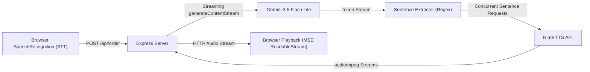

# QuickOrder: Voice-Native Coffee Shop Ordering Assistant

QuickOrder is a voice-native ordering assistant designed to solve and measure one of the hardest challenges in conversational AI: **perceived response time / Time-To-First-Audio (TTFA)**.

---

## 🎯 Product, Target User, and Problem

- **Product**: QuickOrder Voice Assistant (DataForge 2026 Prototype).
- **Target User**: Coffee shop customers placing spoken orders, and voice AI engineers benchmarking real-time conversational streaming latency.
- **Problem Solved**: Standard voice AI systems generate the entire LLM response before sending text to Text-to-Speech (TTS). For detailed responses, this creates a 2–5 second delay where the user hears uncomfortable silence. QuickOrder eliminates this delay by streaming LLM tokens, extracting complete sentences on the fly, and synthesizing TTS audio concurrently.

---

## ⚡ The Hard Voice Problem: Perceived Response Time (TTFA)

Time-To-First-Audio (TTFA) is measured from the exact millisecond the user finishes speaking (releases the talk button) to the exact millisecond audio output starts playing through the speaker (`play` event).

### What it Compares:
1. **Baseline**: Waits for the full Gemini response to finish generating, then sends the complete text payload to Rime TTS.
2. **Optimized (Streaming)**: Streams Gemini tokens, detects sentence boundaries (`[.!?]`) in real-time, immediately triggers Rime TTS synthesis for each sentence concurrently, and streams audio bytes to the browser ordered via MediaSource Extensions (MSE).

---

## 🏗️ Architecture: How the Pieces Connect



1. **Client STT**: Web Speech API captures speech and sends transcript to `/api/order`.
2. **LLM Generation**: Express server invokes `@google/genai` `generateContentStream`.
3. **Sentence Chunking**: Buffer collects tokens and extracts complete sentences on boundary regex `[\s\S]*?[.!?](?=\s|$)`.
4. **Concurrent TTS**: Each extracted sentence immediately initiates a `POST https://users.rime.ai/v1/rime-tts` request.
5. **Ordered Audio Streaming**: Audio bytes are piped to client response headers (`Content-Type: audio/mpeg`).
6. **MSE Playback**: Browser consumes chunked audio with `ReadableStream` & MediaSource Extensions for immediate playback.

---

## 🎙️ Rime Configuration

QuickOrder uses the live Rime HTTP streaming synthesis endpoint:

- **Endpoint**: `POST https://users.rime.ai/v1/rime-tts`
- **Model**: `mistv2`
- **Speaker / Voice**: `astra`
- **Language**: `eng`
- **Output Format**: `audio/mpeg`
- **Transport**: HTTP Streaming (`Accept: audio/mpeg`)
- **Sampling Rate**: `22050` Hz
- **Speed Alpha**: `1.0`

---

## 🚀 Setup & Running Instructions

### 1. Requirements
- Node.js v20.6.0+ (Tested on Node.js v24)
- Gemini API Key ([Google AI Studio](https://aistudio.google.com/))
- Rime API Key ([Rime AI Dashboard](https://rime.ai/))

### 2. Configure Environment Variables
Create a `.env` file in the root directory (copied from `.env.example`):
```env
GEMINI_API_KEY=your_gemini_api_key_here
RIME_API_KEY=your_rime_api_key_here
```

### 3. Install Dependencies
```bash
npm install --no-package-lock
```

### 4. Start the Application
```bash
npm start
```
The server will start listening at `http://localhost:5000`.

### 5. Accessing the Web App
Open `http://localhost:5000` in Google Chrome. Use the **Hold to Speak** button or fallback text input field to submit an order.

---

## 🧪 Acceptance Test Procedure

1. Click the **Run Stress Test** button on the UI.
2. The benchmark sends a long prompt (*"Tell me your full menu and today's specials in detail, plus your allergen policy"*) through **Baseline** and **Optimized** modes back-to-back.
3. Observe the live TTFA comparison table and visual latency bar graphs.
4. Verify backend server metrics at `GET http://localhost:5000/api/metrics`.

---

## 🔴 Live vs. Simulated

**100% Live**: Every component in this application is live.
- Real-time Gemini stream generation.
- Real-time Rime HTTP streaming audio synthesis.
- Real-time browser audio decoding & playback timing.
- No precomputed audio files, cached responses, or artificial delays are used.

---

## ⚠️ Known Limitations

- **Browser Support**: Web Speech API (`SpeechRecognition`) requires Chrome or Chromium-based browsers.
- **Single Concurrent User**: Server metrics are collected in-memory for single-session experiments.
- **Latency Floor**: Gemini Time-To-First-Token (TTFT) and the duration of the first complete sentence define the absolute lower bound of TTFA.
- **No Telephony/Payments**: Demo focuses strictly on measuring voice streaming latency.

---

## 📜 Credits & License

- Built for **DataForge 2026**.
- Powered by Google Gemini (`@google/genai`), Rime TTS (`mistv2`), and Express.js.
- License: MIT
